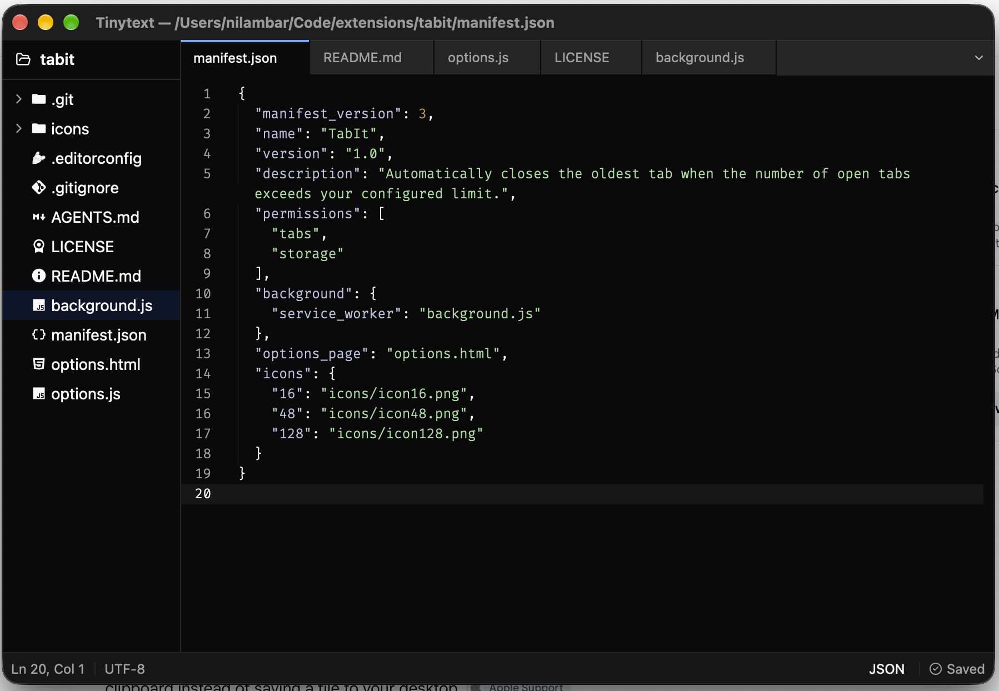

# Tinytext

A fast, lightweight text editor for macOS.

## Screenshot



## Features

- Tabs, each with its own file
- Syntax highlighting for Rust, TOML, JSON, Markdown, JavaScript, TypeScript, Python,
  HTML, CSS, and PHP
- File explorer sidebar for browsing a project folder
- Reopens your tabs and folder where you left off
- Warns before closing a file with unsaved changes
- Cursor position, encoding, and language in the status bar
- `tinytext` command to open files from the terminal
- Shows up in Finder's "Open With" menu for text files
- Dark theme

## Requirements

- macOS 15 or later
- Apple Silicon Mac (M1 or newer)

## Install

Install with [Homebrew](https://brew.sh):

```sh
brew tap ernilambar/tap
brew trust ernilambar/tap
brew install --cask ernilambar/tap/tinytext
```

This installs Tinytext into `/Applications`.

### Install script

Without Homebrew, run this in Terminal:

```sh
curl -fsSL https://raw.githubusercontent.com/ernilambar/tinytext/main/scripts/install.sh | sh
```

### Manual download

Download `Tinytext-macos-arm64.zip` from the
[latest release](https://github.com/ernilambar/tinytext/releases/latest), unzip it, and
move `Tinytext.app` to `/Applications`.

Tinytext is not notarized by Apple, so macOS blocks it the first time you open a copy
downloaded in a browser. To allow it, run this once:

```sh
xattr -dr com.apple.quarantine /Applications/Tinytext.app
```

## Update

Choose **Tinytext → Check for Updates…** to see if a new version is out. To update, save
your work and run:

```sh
brew upgrade --cask tinytext
```

If you used the install script, run it again instead. It replaces the existing app with
the latest release.

## Usage

### Keyboard shortcuts

| Shortcut | Action |
| --- | --- |
| `Cmd+N` | New file |
| `Cmd+O` | Open file |
| `Cmd+S` | Save |
| `Cmd+W` | Close tab |
| `Cmd+B` | Show or hide the sidebar |
| `Cmd+,` | Open settings |
| `Cmd+Q` | Quit |

Open a folder in the sidebar with **File → Open Folder…**.

### Open files from Terminal

Choose **Tinytext → Install Command Line Tool…** and enter your password when asked.
Then:

```sh
tinytext notes.txt
tinytext one.txt two.txt
tinytext .
```

## Uninstall

```sh
brew uninstall --cask --zap tinytext
sudo rm -f /usr/local/bin/tinytext
```

`--zap` also removes your saved session and settings. The second line removes the
command line tool, if you installed it.

Without Homebrew:

```sh
rm -rf /Applications/Tinytext.app
sudo rm -f /usr/local/bin/tinytext
rm -rf ~/Library/Application\ Support/net.nilambar.tinytext
```

## Releasing

`version` in `Cargo.toml` is the single source of truth. Bump it, then let cargo update
`Cargo.lock`:

```sh
# edit version in Cargo.toml
cargo update -p tinytext
```

Run the quality gate, then tag the release so it matches the version:

```sh
cargo fmt --check
cargo clippy --all-targets -- -D warnings
cargo test
cargo build

git tag v0.1.3
git push origin v0.1.3
```

The GitHub Actions workflow builds, signs, and publishes `Tinytext-macos-arm64.zip` to a
GitHub Release.

## Contributing

Bug reports and pull requests are welcome. See [CONTRIBUTING.md](CONTRIBUTING.md) to
build Tinytext from source.

## License

[MIT](LICENSE) © Nilambar Sharma ([nilambar.net](https://nilambar.net/))
